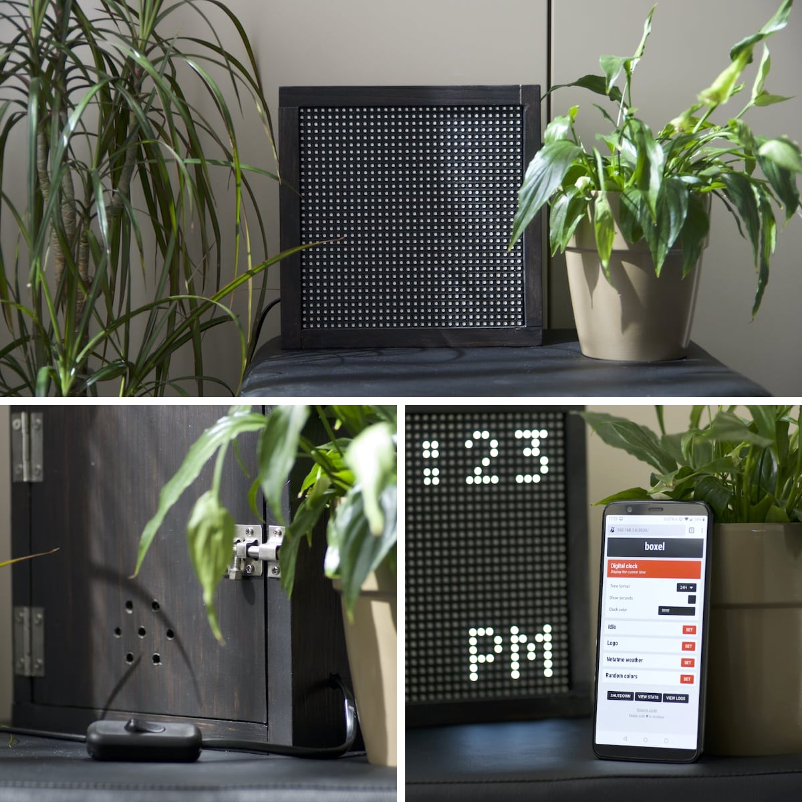
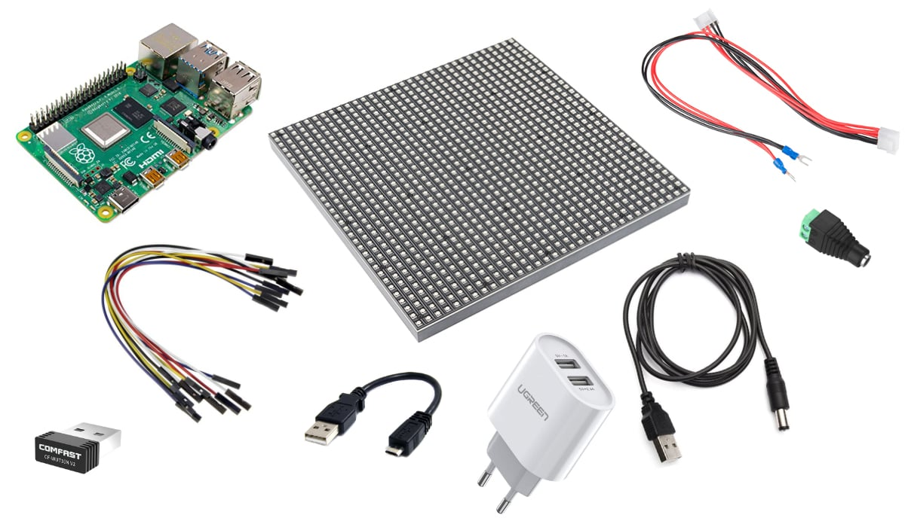

Boxel is a wooden box that contains a Raspberry Pi and a 32x32 LED matrix.

It can be remote-controlled through a local HTTP server, to display various data.

* 📸 [Making-of & pictures](media)
* 🛠️ [Material](#material)
* 💾 [Software installation](#software-installation)
* 💡 [Credits](#credits)

## Material



* Raspberry Pi with a 40 pin GPIO header
* 32x32 LED matrix and its DC cable
* 14 female to female jumper wires
* DC to female 2.1mm Jack adapter
* 5V male Jack to male USB adapter (1A)
* Micro USB to USB adapter (2.4A)
* USB to AC adapter (5V 3.4A with 2 ports)
* USB Wi-Fi dongle
* A few wooden planks, screws, small shelf brackets

## Software installation

### On the dev machine

Clone the project and install the dependencies:

```
git clone git@github.com:johansatge/boxel.git
cd boxel/app
npm install
```

Start the app in dry run (so it doesn't try to initialize the LED matrix):

```
node app/index.js --dry-run
```

### On the Raspberry Pi

#### Base install

* Use [Raspberry Pi Imager](https://www.raspberrypi.org/downloads/) to install the latest Raspbian on the SD card (tested version: `10 Buster`)
* From the GUI (`startx`), configure:
  * The user (`pi`), date, location
  * The wifi
  * Enable SSH & [configure a key](https://www.raspberrypi.org/documentation/remote-access/ssh/passwordless.md) if needed
* Disable on-board sound in `/boot/config.txt` by setting `dtparam=audio=off`

#### Node JS

Install Node JS LTS (tested version: `node 12.16.2` / `npm 6.14.4`)

```
curl -sL https://deb.nodesource.com/setup_12.x | sudo bash -
sudo apt-get install nodejs
```

#### Project installation

On the dev machine, sync the app:

```
sh sync.sh
```

On the Pi, install the dependencies:

```
cd /home/pi/boxel-app
npm install
```

On the Pi, start the app:

```
sudo node /home/pi/boxel-app/index.js
```

## Credits

* [hzeller/rpi-rgb-led-matrix](https://github.com/hzeller/rpi-rgb-led-matrix)
* [alexeden/rpi-led-matrix](https://github.com/alexeden/rpi-led-matrix) (Node binding for the original library)
* [Connecting a 16x32 RGB led matrix panel to a Raspberry Pi](https://learn.adafruit.com/connecting-a-16x32-rgb-led-matrix-panel-to-a-raspberry-pi/wiring-the-display)
